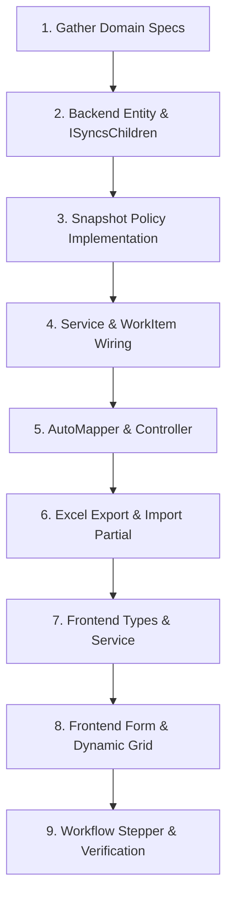

# Request Ticket & Business Document Workflow ("Phiếu")

This skill guides the end-to-end development of request tickets and business documents ("Phiếu") in `cogain-core`. It codifies the architectural standards for multi-aggregate tickets, ensuring data integrity across microservices, tamper-proof snapshots, child collection reconciliation, workflow synchronization, and Excel import/export.

---

## 1. Architectural Blueprint & Progressive Disclosure

A request ticket in `cogain-core` connects multiple domains (HR, MasterData, Workflow, ServiceDesk, ERP). To maintain code clarity and context efficiency, the implementation runbooks are separated into dedicated reference documents:

* **[Backend Architecture & Reference](./references/backend.md)**: Deep dive into Entity modeling, `ISyncsChildren` reconciliation, `ISnapshotPolicy` two-phase engine (Collect & Apply), `IWorkItemLifecycleService` transaction boundaries, and generic step transitions.
* **[Frontend Architecture & Reference](./references/frontend.md)**: Deep dive into TypeScript interfaces, `createBaseService` extensions, Header forms with `useRefDocSelector`, dynamic child tables with `ResizableWrapTable` / `SortableWrapTable`, and workflow stepper integration.
* **[Excel Import & Export Guide](./references/excel.md)**: Complete guide to exporting ticket data leveraging frozen snapshots (0 extra gRPC calls), generating `.xlsx` templates with lookup catalogs, and validating/importing line items.

---

## 2. Core Pillars of a "Phiếu"

### 1. Two-Phase Snapshot Policy (`ISnapshotPolicy`)
Microservices prevent synchronous cross-database joins with external services (`HR`, `MasterData`). Every foreign reference (Supervisor, Employee, Department, Project, Item) must store its frozen `*CodeSnapshot` and `*NameSnapshot`.
* **Collect Phase (Outside Transaction)**: Diff input against `PriorReferences` in DB; batch-resolve changed references over gRPC without holding database transaction locks.
* **Apply Phase (Inside Transaction)**:
  * For `Create`: Apply snapshots in `AfterMapperAsync`.
  * For `Update`: Apply snapshots in `AfterReconcileCollectionsAsync` (**MUST** run after child collections are synchronized so newly added detail rows have valid identities).
  * For Custom Actions with updates: Run within `ExecuteCompensatedTransactionAsync` and apply before `SaveChangesAsync`.

### 2. Child Collection Reconciliation (`ISyncsChildren`)
* **Never use AutoMapper reflection to map child collections** on update (AutoMapper will create duplicate rows and corrupt tracking).
* Entity implements `ISyncsChildren<T>` and uses `SyncChildCollection(Details, incoming, d => d.ItemId, onUpdate: ...)`.
* Service overrides `BuildIncomingGraph(UpdateDto, existingEntity)` to create the target graph.
* Service declares `GetUpdateIncludeString() => "Details,Attachments"`.

### 3. WorkItem / Workflow Lifecycle Sync
* Every ticket is paired with a `WorkItem` in the MasterData / WorkFlow engine.
* **On Create**: Use `_workItemLifecycleService.CreateWithWorkItemAsync` to simultaneously persist the local record and initialize the ticket's process, category, and start step.
* **On Step Transition**: Use `_workItemLifecycleService.TransitionAsync` (`ChangeStep`).
* **Cross-Ticket Cascading Transitions (`ExecuteTransitionAsync`)**: When advancing Ticket A also triggers transitions/creation of Ticket B (e.g. `ProductionOrderService.ExecuteTransitionAsync`), run inside `ExecuteCompensatedTransactionAsync` and pass `compensationScope` to child ticket operations. If child ticket operations fail, Ticket A is safely rolled back.
* **On Custom Action with Data**: Always place the `TransitionAsync` call **LAST** in the compensated transaction. If the step transition fails, the local SQL transaction rolls back cleanly.

### 4. Excel Export & Snapshots Synergy
* When exporting tickets to Excel, **read directly from snapshot columns** (`*CodeSnapshot`, `*NameSnapshot`).
* This eliminates N+1 gRPC calls across microservices and guarantees sub-second export generation even for thousands of rows.

---

## 3. Step-by-Step Implementation Workflow

When asked to create a new "Phiếu", follow this sequential procedure:



### Step 1: Gather Domain Specifications
Before writing code, identify:
1. **Target Microservice**: (e.g. `ServiceDesk`, `HR`, `BizDoc`).
2. **Document Name & Category**: (e.g. `LeaveRequest`, `BusinessTripRequest`, `SupplyRequest`).
3. **Foreign References Needing Snapshots**:
   * Header: `Department`, `Supervisor`, `Organization`.
   * Details: `Employee`, `Project`, `Item`, `UnitOfMeasure`.
4. **Child Collections**: Usually `Details` and `Attachments`.
5. **Workflow Actions**: Available steps (Submit, Approve, Reject, Return).

### Step 2: Implement Backend Aggregate
1. Create Entity in `backend/src/Services/{Svc}/{Svc}.Data/Entities/{Feature}/{Ticket}.cs`.
   - Inherit `EntityAuditBase<Guid>`, `ITicketAccessControl`, `ISyncsChildren<{Ticket}>`.
   - Implement `SyncChildren` using `SyncChildCollection`.
2. Create Detail Entity with snapshot columns (`ItemCodeSnapshot`, `ItemNameSnapshot`, `ProjectCodeSnapshot`, etc.).
3. Configure EF Core in `Persistence/Configurations/`:
   - Set table names, decimal precisions, and string limits.
   > [!IMPORTANT]
   > Do NOT run EF migration commands automatically (`dotnet ef migrations add`). Leave migrations for the user to execute manually.

### Step 3: Implement Snapshot Policy
Create `{Ticket}SnapshotPolicy.cs` in `Services/Implement/{Feature}/`:
- Implement `ISnapshotPolicy<CreateAndUpdate{Ticket}Dto, {Ticket}>`.
- Define `HeaderFields` and detail bindings with `SnapshotBindingKey`.
- Implement `CollectAsync`: Compare against `LoadCurrentReferencesAsync` and call `engine.CollectAsync`.
- Implement `Apply`: Map resolved values onto target entity targets.
- Register scoped policy in `ServiceExtensions.cs`: `services.AddScoped<{Ticket}SnapshotPolicy>();`.

### Step 4: Implement Service with WorkItem & Child Sync
Create `{Ticket}Service.cs`:
- Inherit `BaseService<{Ticket}, {Ticket}Dto, Create{Ticket}Dto, Update{Ticket}Dto, ...>`.
- Override `GetUpdateIncludeString()` and `GetDeleteIncludeString()`.
- Override `BuildIncomingGraph(Update{Ticket}Dto, {Ticket} existing)`.
- Override `Create`: Wrap in `_snapshotLifecycle.ExecuteAsync` calling `_workItemLifecycleService.CreateWithWorkItemAsync`.
- Override `AfterMapperAsync`: Call `_snapshotLifecycle.ApplyCurrent(entity, _snapshotPolicy.Apply)`.
- Override `Update`: Wrap in `_snapshotLifecycle.ExecuteAsync`.
- Override `AfterReconcileCollectionsAsync`: Call `_snapshotLifecycle.ApplyCurrent(entity, _snapshotPolicy.Apply)`.
- Implement `ChangeStep(id, currentStepId, actionCode, comment)`.
  - **Cascading Step Changes**: If changing a step triggers a step change on another ticket (Ticket B), spawns downstream tickets, or auto-completes a parent WorkItem, follow the clean **`ExecuteTransitionAsync`** pattern from `ProductionOrderService` using `ExecuteCompensatedTransactionAsync` with `compensationScope` (see [backend.md Pattern 3](./references/backend.md#pattern-3-cascading-cross-ticket-step-transitions-clean-pattern-from-productionorderservice)).

### Step 5: Configure Mapping, Controller & Excel
1. In `MappingProfile.cs`:
   - Map Entity <-> DTO.
   - **Ignore `Details` and `Attachments` on `Update{Ticket}Dto -> {Ticket}`**.
2. In `{Ticket}Service.Excel.cs` or `{Ticket}Service.Method.cs`:
   - Define **`ExcelSchema`** with strongly-typed `ExcelColumn(Index, Name, Required)` records for Header, Details, and lookup sheets (no magic column numbers!).
   - Implement `GetExportDataFileName()`.
   - Implement `GenerateExportDataBytesAsync(AutoFilter parameters)` using ClosedXML and snapshot columns (see [excel.md](./references/excel.md)).
   - Implement `CustomParseExcelToDtosAsync`, `LoadImportReferencesAsync`, and `ValidateImportDtosAsync` if import is supported.
3. Create `{Ticket}sController.cs`:
   - Standard CRUD endpoints via `BaseController`.
   - Add `POST {id}/change-step` -> calls `_service.ChangeStep`.
   - Add `GET export-data` -> calls `_service.ExportDataAsync`.

### Step 6: Implement Frontend Types & Service
1. Create `types/{ticket}.type.ts`:
   - Export `I{Ticket}Request`, `I{Ticket}Detail`, `I{Ticket}Attachment`.
   - Include all `*CodeSnapshot` and `*NameSnapshot` fields.
2. Create `services/{ticket}-service.ts`:
   - Wrap with `createBaseService`.
   - Add `changeStep(id, body)` and `exportData(params)`.

### Step 7: Build List Page, Filter Popover, Slideout Form & Dynamic Child Table
1. **4 Foundation Columns & Golden Rule of Alignment on List Tables**:
   - Every ticket list table **MUST** render at least:
     1. `Mã phiếu`: Text link (opens detail), sticky pinned left, sorts by code string (`align: 'center'`).
     2. `Trạng thái phiếu`: Status badge according to Design System tokens (`align: 'center'`).
     3. `Ngày tạo`: 2-line cell with `ModifierInfo` (Line 1: Calendar icon + DD/MM/YYYY HH:mm; Line 2: User icon + Username/Staff code) (`align: 'center'`).
     4. `Ngày cập nhật`: 2-line cell with `ModifierInfo` (Line 1: Calendar icon + DD/MM/YYYY HH:mm; Line 2: User icon + Username/Staff code) (`align: 'center'`).
   - **Golden Rule of Alignment**: Header and Body Cell MUST share identical alignment:
     - Text / Long Strings -> `align: 'left'`
     - Numbers / Currency -> `align: 'right'`
     - Short IDs / Dates / Times / Status / Actions -> `align: 'center'`
2. **Top Action Bar Standards**:
   - Order: `[ Quick Search ] ──> [ Filter Button ] ──> [ Import ] ──> [ Export ] ──> [ + Add New ] ──> [ Divider 1px x 20px, margin 8px ] ──> [ ⚙ Settings 36x36 ]`.
   - Uniform 36px height (`h-9`).
   - Clean Table Header: Single-sort icon only (`⇅`, `↑`, `↓`), NO inline filter dropdowns or search funnels.
3. **List Page Filtering (`<Ticket>FilterPopover`)**:
   - **NEVER** combine raw inline `<select>` tags or ad-hoc filters directly into the toolbar of list screens.
   - **MANDATORY**: Build a dedicated `<[Ticket]FilterPopover>` component using **`FilterPopoverLayout`** (from `@shared/components`) or `Popover` (from `@shared/ui`). Reference: `AcceptanceMinuteFilterPopover` or `InstallationOrderFilterPopover`.
   - The trigger button displays a `Filter` icon, label "Bộ lọc", and an active badge when `filterCount > 0`. Exclude system pagination/sort params from count.
   - 1:1 mapping with table columns. Auto-reset pagination to `page: 1` on Apply/Reset.
4. **Slideout Form (`Sheet`) — 85% Width Standard & 3-Section Architecture**:
   - **MANDATORY**: All ticket forms must use a **Slideout Sheet** (`Sheet` from `@shared/ui` with `side="right"`) standardized strictly to **85% width**:
     ```tsx
     <SheetContent
       side="right"
       className="w-full sm:max-w-[85%] p-0 gap-0 border-l shadow-xl flex flex-col"
       onInteractOutside={(e) => e.preventDefault()}
     >
     ```
   - Never use basic modal dialogs.
   - **3 Fixed Sections**:
     1. Header pinned top (py-3 px-5, border-b, 36x36 back button `[←]`, `<ResourceVersionBadge />`).
     2. Main content scrollable (`overflow-y: auto`, padding 20px `p-5`, gap 16px `gap-4`).
        - General Information Card: Background `--Colors-Background-secondary` (`#FAFAFA`), rounded-xl, padding 16px (`p-4`), gap-3. Related fields gap 8px (`gap-2`), independent fields gap 12px (`gap-3`).
     3. Footer pinned bottom (`sticky bottom-0 z-50`, py-3 px-5, border-t, bg-white, 36px buttons: `[Hủy]` and `[Lưu]`).
5. **Strict Ban on Raw HTML Controls (Use Shared Components)**:
   - **NEVER use raw HTML controls** like `<select>`, `<option>`, `<input type="date">`, `<input type="time">`, or `<input type="number">`.
   - Use `CustomSelect`, `CustomMultiSelect`, `Combobox`, `LazyCombobox`, `DatePicker` (with `showTime={true}` if needed), `DateRangeInput`, and `NumericInput`.
6. **Hook Layer Encapsulation (No Direct Service Calls in TSX)**:
   - **NEVER call service instances directly in TSX/JSX**. Always consume queries and mutations (`createMutation`, `updateMutation`, `changeStepMutation`) through the custom hook `use<Ticket>()`.
7. **Zero Hardcoded Text**:
   - **NEVER hardcode raw text strings**. All UI text (labels, placeholders, empty states, validation messages, button text) must use `useTranslation` with fallback `defaultValue` (e.g. `t('ticket:field', { defaultValue: 'Text' })`).
8. **Detail Dynamic Table with Mandatory Search & Filter (`ResizableWrapTable`)**:
   - **NEVER use raw HTML `<table>`**.
   - **MANDATORY SEARCH & FILTER IN EVERY DETAIL TABLE**: Every detail table MUST have both search and filter configured via `toolbarProps` of `ResizableWrapTable`.
   - Wide multi-column filter layout: `renderFilterContent: (close) => <form className="space-y-4 w-200">` containing a multi-column responsive grid (`grid grid-cols-1 md:grid-cols-2 xl:grid-cols-3 gap-4`) of Comboboxes / CustomSelect, and Reset/Apply buttons.
   - `[+ Thêm dòng]` Button: right-aligned secondary outlined primary (border 1px solid brand color, bg #FFF, hover brand-50, text brand, font-semibold, 28-32px height, 6-8px rounded).
   - Sub-table attached tabs: Zero-Gap rule (`margin-bottom: 0`, `gap: 0`, `rounded-tl-none`, header min-height 44px, Teal-50 background).
   - Use `SortableWrapTable` (from `@shared/components/sortable-wrap-table`) whenever rows require drag-and-drop row reordering.
   - Show snapshot labels in read-only mode to prevent lookup overhead.

### Step 8: Wire Detail Page, Version Badge & Workflow Stepper
1. In `$id/detail.tsx`:
   - **Mandatory Version Badge**:
     - In `WorkItemDetailLayout` `title`, wrap the name and `<ResourceVersionBadge resourceName={`${WorkItemCategoryCode.Ticket}`} />`.
     - In `CollapsibleInfoGrid` / header info card, when `isAdmin`, add `<InfoField label={t('common:version', { defaultValue: 'Phiên bản' })} value={<ResourceVersionBadge resourceName={`${WorkItemCategoryCode.Ticket}`} />} />`.
   - Register version and changelog entry in `frontend/shared/config/resource-version.json`.
   - Display `WorkItemStepper` showing current step & status.
   - Render available action buttons dynamically from `item.workItemInfo.actions`.
   - On transition click: execute `changeStepMutation.mutateAsync` from `use<Ticket>()` (NEVER call service directly in UI).
   - Invalidate TanStack query cache upon successful transition.

---

## 4. Verification & Validation Checklist

Before completing any "Phiếu" implementation:

- [ ] **Backend Compilation**: `dotnet build backend/src/Services/{Svc}/{Svc}.API` succeeds with 0 errors.
- [ ] **Child Collection Sync**: `ISyncsChildren` implemented; AutoMapper ignore rule configured on update.
- [ ] **Snapshot Two-Phase Rule**:
  - `CollectAsync` runs outside the transaction.
  - `Apply` runs in `AfterMapperAsync` (Create) and `AfterReconcileCollectionsAsync` (Update).
- [ ] **WorkItem Lifecycle**: Ticket created with `CreateWithWorkItemAsync`; step transition placed last in compensated transactions.
- [ ] **Cascading Step Changes**: Cross-ticket step changes follow `ExecuteTransitionAsync` pattern inside `ExecuteCompensatedTransactionAsync` with `compensationScope`.
- [ ] **Export Integrity**: Excel export reads snapshot columns directly; does NOT execute N gRPC queries for static names.
- [ ] **Slideout Form Format**: Ticket form is built as a Slideout `Sheet` (`side="right"`), not a basic dialog.
- [ ] **Table Component Standard**: Detail tables use `ResizableWrapTable` with `toolbarProps` (or `SortableWrapTable` for reordering); no raw HTML `<table>`.
- [ ] **Zero Hardcoded Strings**: All text, labels, placeholders, and messages use `useTranslation` with `defaultValue`.
- [ ] **Resource Version Badge**: `<ResourceVersionBadge resourceName={`${WorkItemCategoryCode.Ticket}`} />` included in layout title, sheet header, and admin `InfoField`.
- [ ] **Frontend TypeScript**: `npm run build` or typecheck passes with 0 type errors.
- [ ] **Read-Only Stability**: Read-only screens render `*CodeSnapshot` / `*NameSnapshot` without additional network calls.
